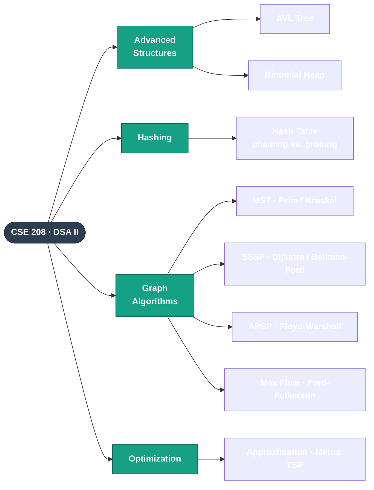

<h1 align="center">CSE 208 — Data Structures and Algorithms II (Sessional)</h1>

<p align="center">
  
  
  
  
</p>

<p align="center">
  <b>Undergraduate lab coursework — Bangladesh University of Engineering and Technology (BUET)</b><br>
  Advanced data structures and the core algorithms of graph theory &amp; combinatorial optimization —
  shortest paths, spanning trees, network flow, and approximation — each built <b>from scratch</b> in C++.
</p>

---

## 📖 About this course

**CSE 208** is the second data-structures-and-algorithms laboratory in the BUET CSE undergraduate
curriculum, building on CSE 204. It moves into balanced trees, mergeable heaps, hashing, and the
workhorse algorithms of graphs and optimization.

Every assignment folder is self-contained — it holds the **specification**, the **source code**,
sample **input / output**, and a short **README** describing the approach.

## 🗺️ Topic map



## 🗂️ Assignments

| Topic | Folder | Key idea |
|-------|--------|----------|
| **AVL Tree** | [`AVL tree`](AVL%20tree) | Height-balanced BST via LL/RR/LR/RL rotations, with timing analysis |
| **Binomial Heap** | [`Binomial Heap`](Binomial%20Heap) | Mergeable heap — union by binomial-tree linking, insert, extract-min |
| **Hashing** | [`Hashing`](Hashing) | Separate chaining vs. open addressing; empirical probe-count analysis |
| **MST** | [`MST`](MST) | Minimum spanning tree via **Prim** (PQ) and **Kruskal** (union-find) |
| **SSSP** | [`SSSP`](SSSP) | Single-source shortest paths — **Dijkstra** &amp; **Bellman-Ford** |
| **APSP** | [`APSP`](APSP) | All-pairs shortest paths — **Floyd-Warshall** &amp; matrix-multiplication |
| **Max Flow** | [`MaxFlow`](MaxFlow) | Ford-Fulkerson max flow + a **baseball-elimination** application |
| **Approximation** | [`approximation`](approximation) | MST-based **2-approximation** for metric TSP vs. Held-Karp exact |

## 🎯 A taste of the output

<details open>
<summary><b>Max Flow — Baseball Elimination</b> (which team is mathematically out?)</summary>

```text
Detroit is eliminated.
They can win at most 49 + 27 = 76 games.
New_York, Boston, Baltimore and Toronto have a total of 278 games.
They play each other 27 times.
So on average, each team in this group wins 305/4 = 76.25 games — more than Detroit can reach.
```
</details>

## ⚙️ Building &amp; running

Most assignments read an input file and write an output file in the same directory:

```bash
cd MST
g++ -std=c++17 main.cpp -o main      # tested with g++ 14.2
./main                                # reads input.txt → prim.txt, kruskal.txt
```

The exact input/output filenames for each task are listed in that folder's `README.md`.

> Build artifacts (`*.exe`, `.dist/`, `.vscode/`), archives, and bulky stress-test data are excluded
> via `.gitignore`.

## 👤 Author

**Md. Rafiul Islam** — Student ID `2005035`
Department of Computer Science &amp; Engineering, BUET

---

<p align="center"><sub>Archived academic coursework · CSE 208 · January 2023 term</sub></p>
